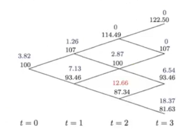
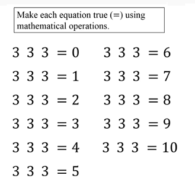

# Code Depot - Coding Challenges, Random Code Modules, etc.

This repository's goal is to be a way to share/host some small standalone scripts that don't need a whole repository.

## American / European Options Pricing with Binomial Model - [OptionsPricingBinomialModel.py](OptionsPricingBinomialModel.py)

Pricing American and European put and call options using a basic binomial model (extensible to trinomial). Based off math described here: https://youtu.be/L8hMr07F4k8 and https://youtu.be/j4bl6AFpOr0

Algorithm generates a tree of nodes and calculates backward to determine pricing for all nodes. Also determines when an American option should be exercised early. Should be easily extensible for models with more than just 2 branches per node - such as trinomial model.

## Generalized Threes Challenge Solver - [GeneralizedThreesChallengeSolver.py](GeneralizedThreesChallengeSolver.py)

The problem: Make each equation true using mathematical operations. You should be able to do all except 10 with just add, subtract, multiply, divide, factorial, sqrt. Problem from: https://www.youtube.com/watch?v=SkP2VBzgpKA

This code takes an arbitrary input tuple, in this case (3,3,3), and does a breadth first search of the space of possible solutions to find all valid integer solutions. The code prints all valid solutions and path to reach those solutions.

Notes

- The input tuple can be any length, and have any integers on it. 
- To add your own functions, just add them to the list join_functions or inplace_modifier_functions and the code will incorperate those into the search.
- Breadth first search nodes are filtered if they are obviously invalid

## Disjoint Set - ([DisjointSet.py](DisjointSet.py))

A Python implementation of the Disjoint Set data structure represented as a single-level UpTree. Including list uptree structure as well as a "quick n' dirty" numpy implementation with slightly worse time/space complexity (but it's only a few lines of code!)

Used this data structure to solve some "flood-fill" type code challenges, and couldn't find an existing Python implementation.

## Binary Search - ([BinarySearch.py](BinarySearch.py))

Simple binary search implementation - given func() and a target output, finds the value of x such that: `target_output = func(x)`

Was tired of re-writing this code every time I needed it...